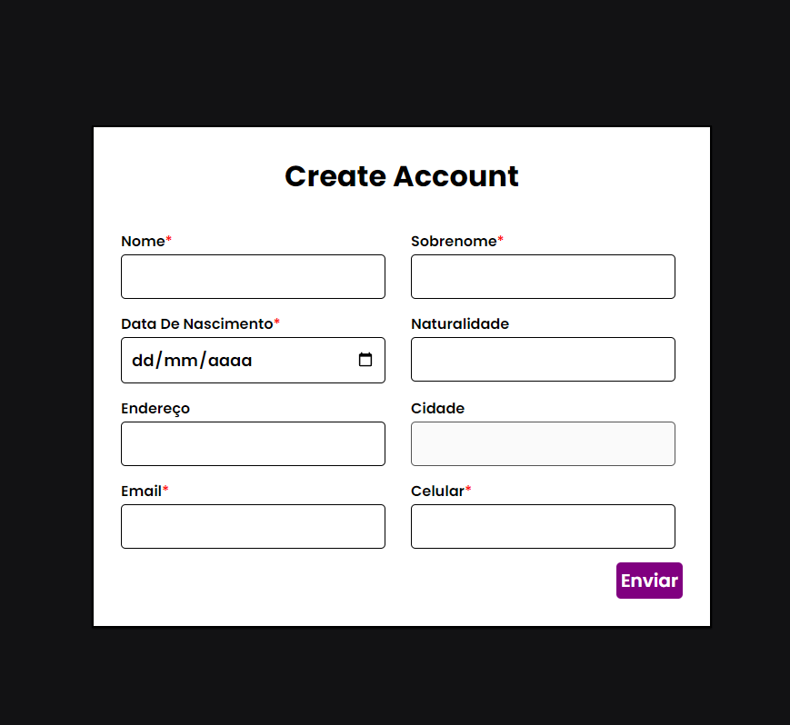

# Form-cadastro

  O projeto é uma aplicação desenvolvida em React que oferece uma experiência prática e educativa no mundo dos formulários em desenvolvimento web. Utilizando as poderosas bibliotecas Formik e Yup, nosse projeto tive uma compreensão mais aprofundada e prática de como criar e validar formulários de maneira eficiente e robusta no contexto do React.

# Tecnologias 
* React⚛️
* Lib Formik e Yup ✔️

## Veja como é: 
![Form formik]
<h1 align="center">
  
</h1>

 ### Instalando dependências do projeto.
  * yarn add formik
  * yarn add yup

 ⚡

Feito por <a href="https://www.linkedin.com/in/mickaias-kaw%C3%A3-348340233/">Mickaias Nunes</a>🚀🚀
